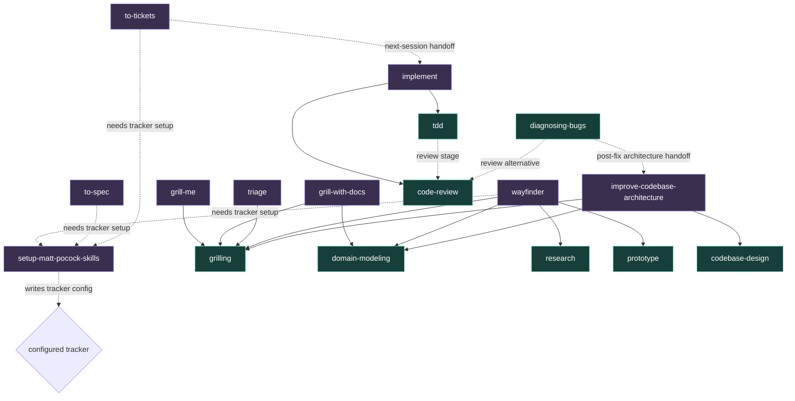

# Skills

## Source attribution

The skills below are adapted from external sources. Each source link is pinned to the revision used locally; use the tracking links when checking for updates.

| Local skill | Pinned source | Track updates | Local adaptation |
| --- | --- | --- | --- |
| `ask-matt` | [`engineering/ask-matt`](https://github.com/mattpocock/skills/blob/885e2ca4d842d139e9aef4e48d366c63cb1b8013/skills/engineering/ask-matt/SKILL.md) | [`main`](https://github.com/mattpocock/skills/blob/main/skills/engineering/ask-matt/SKILL.md) | Matches upstream. |
| `code-review` | [`engineering/code-review`](https://github.com/mattpocock/skills/blob/885e2ca4d842d139e9aef4e48d366c63cb1b8013/skills/engineering/code-review/SKILL.md) | [`main`](https://github.com/mattpocock/skills/blob/main/skills/engineering/code-review/SKILL.md) | Adds adversarial-risk review, Feature Contracts, and harness-agnostic parallel review. |
| `codebase-design` | [`engineering/codebase-design`](https://github.com/mattpocock/skills/blob/885e2ca4d842d139e9aef4e48d366c63cb1b8013/skills/engineering/codebase-design/SKILL.md) | [`main`](https://github.com/mattpocock/skills/blob/main/skills/engineering/codebase-design/SKILL.md) | Matches upstream, including model invocation. |
| `diagnosing-bugs` | [`engineering/diagnosing-bugs`](https://github.com/mattpocock/skills/blob/885e2ca4d842d139e9aef4e48d366c63cb1b8013/skills/engineering/diagnosing-bugs/SKILL.md) | [`main`](https://github.com/mattpocock/skills/blob/main/skills/engineering/diagnosing-bugs/SKILL.md) | Retains diagnosis-only mode and conditional state-space analysis. |
| `domain-modeling` | [`engineering/domain-modeling`](https://github.com/mattpocock/skills/blob/885e2ca4d842d139e9aef4e48d366c63cb1b8013/skills/engineering/domain-modeling/SKILL.md) | [`main`](https://github.com/mattpocock/skills/blob/main/skills/engineering/domain-modeling/SKILL.md) | Matches upstream, including model invocation. |
| `grill-me` | [`productivity/grill-me`](https://github.com/mattpocock/skills/blob/885e2ca4d842d139e9aef4e48d366c63cb1b8013/skills/productivity/grill-me/SKILL.md) | [`main`](https://github.com/mattpocock/skills/blob/main/skills/productivity/grill-me/SKILL.md) | Matches upstream. |
| `grill-with-docs` | [`engineering/grill-with-docs`](https://github.com/mattpocock/skills/blob/885e2ca4d842d139e9aef4e48d366c63cb1b8013/skills/engineering/grill-with-docs/SKILL.md) | [`main`](https://github.com/mattpocock/skills/blob/main/skills/engineering/grill-with-docs/SKILL.md) | Matches upstream. |
| `grilling` | [`productivity/grilling`](https://github.com/mattpocock/skills/blob/885e2ca4d842d139e9aef4e48d366c63cb1b8013/skills/productivity/grilling/SKILL.md) | [`main`](https://github.com/mattpocock/skills/blob/main/skills/productivity/grilling/SKILL.md) | Uses the round-by-round frontier interview with a harness-agnostic research fallback. |
| `handoff` | [`productivity/handoff`](https://github.com/mattpocock/skills/blob/885e2ca4d842d139e9aef4e48d366c63cb1b8013/skills/productivity/handoff/SKILL.md) | [`main`](https://github.com/mattpocock/skills/blob/main/skills/productivity/handoff/SKILL.md) | Matches upstream. |
| `herdr` | [Dillon Mulroy's `herdr`](https://github.com/dmmulroy/.dotfiles/blob/be8575f901b85100251080c1707e3f3c2966dcc9/home/.agents/skills/herdr/SKILL.md) | [`main`](https://github.com/dmmulroy/.dotfiles/blob/main/home/.agents/skills/herdr/SKILL.md) | Matches the pinned source; local OpenAI metadata keeps model invocation enabled. |
| `improve-codebase-architecture` | [`engineering/improve-codebase-architecture`](https://github.com/mattpocock/skills/blob/885e2ca4d842d139e9aef4e48d366c63cb1b8013/skills/engineering/improve-codebase-architecture/SKILL.md) | [`main`](https://github.com/mattpocock/skills/blob/main/skills/engineering/improve-codebase-architecture/SKILL.md) | Matches upstream, including the visual HTML report workflow. |
| `implement` | [`engineering/implement`](https://github.com/mattpocock/skills/blob/885e2ca4d842d139e9aef4e48d366c63cb1b8013/skills/engineering/implement/SKILL.md) | [`main`](https://github.com/mattpocock/skills/blob/main/skills/engineering/implement/SKILL.md) | Invokes the local `tdd` and `code-review` skills without filesystem coupling. |
| `install-anti-slop` | [Dillon Mulroy's `anti-slop`](https://github.com/dmmulroy/anti-slop/blob/6d538555cb151d4121ed51a27db81890eacf8ae9/skills/install-anti-slop/SKILL.md) | [`main`](https://github.com/dmmulroy/anti-slop/blob/main/skills/install-anti-slop/SKILL.md) | Matches upstream, including bundled plugin assets. |
| `prototype` | [`engineering/prototype`](https://github.com/mattpocock/skills/blob/885e2ca4d842d139e9aef4e48d366c63cb1b8013/skills/engineering/prototype/SKILL.md) | [`main`](https://github.com/mattpocock/skills/blob/main/skills/engineering/prototype/SKILL.md) | Integrates outcomes with implementation issues and Feature Contracts. |
| `quality-code` | [Dillon Mulroy's `coding-standards`](https://github.com/dmmulroy/.dotfiles/blob/be8575f901b85100251080c1707e3f3c2966dcc9/home/.agents/skills/coding-standards/SKILL.md) | [`main`](https://github.com/dmmulroy/.dotfiles/blob/main/home/.agents/skills/coding-standards/SKILL.md) | Omits the `better-result` preference and retains local TypeScript edge-case guidance. |
| `research` | [`engineering/research`](https://github.com/mattpocock/skills/blob/885e2ca4d842d139e9aef4e48d366c63cb1b8013/skills/engineering/research/SKILL.md) | [`main`](https://github.com/mattpocock/skills/blob/main/skills/engineering/research/SKILL.md) | Uses background delegation when available and direct research otherwise. |
| `resolving-merge-conflicts` | [`engineering/resolving-merge-conflicts`](https://github.com/mattpocock/skills/blob/885e2ca4d842d139e9aef4e48d366c63cb1b8013/skills/engineering/resolving-merge-conflicts/SKILL.md) | [`main`](https://github.com/mattpocock/skills/blob/main/skills/engineering/resolving-merge-conflicts/SKILL.md) | Matches upstream, including model invocation. |
| `setup-matt-pocock-skills` | [`engineering/setup-matt-pocock-skills`](https://github.com/mattpocock/skills/blob/885e2ca4d842d139e9aef4e48d366c63cb1b8013/skills/engineering/setup-matt-pocock-skills/SKILL.md) | [`main`](https://github.com/mattpocock/skills/blob/main/skills/engineering/setup-matt-pocock-skills/SKILL.md) | Defaults to local markdown under `.scratch/`, retains repository GitHub Issues, and omits GitLab. |
| `triage` | [`engineering/triage`](https://github.com/mattpocock/skills/blob/885e2ca4d842d139e9aef4e48d366c63cb1b8013/skills/engineering/triage/SKILL.md) | [`main`](https://github.com/mattpocock/skills/blob/main/skills/engineering/triage/SKILL.md) | Matches upstream. |
| `tdd` | [`engineering/tdd`](https://github.com/mattpocock/skills/blob/885e2ca4d842d139e9aef4e48d366c63cb1b8013/skills/engineering/tdd/SKILL.md) | [`main`](https://github.com/mattpocock/skills/blob/main/skills/engineering/tdd/SKILL.md) | Matches upstream, including model invocation. |
| `teach` | [`productivity/teach`](https://github.com/mattpocock/skills/blob/885e2ca4d842d139e9aef4e48d366c63cb1b8013/skills/productivity/teach/SKILL.md) | [`main`](https://github.com/mattpocock/skills/blob/main/skills/productivity/teach/SKILL.md) | Includes the upstream workspace format documents. |
| `to-spec` | [`engineering/to-spec`](https://github.com/mattpocock/skills/blob/885e2ca4d842d139e9aef4e48d366c63cb1b8013/skills/engineering/to-spec/SKILL.md) | [`main`](https://github.com/mattpocock/skills/blob/main/skills/engineering/to-spec/SKILL.md) | Matches upstream; tracker behavior comes from per-repository configuration. |
| `to-tickets` | [`engineering/to-tickets`](https://github.com/mattpocock/skills/blob/885e2ca4d842d139e9aef4e48d366c63cb1b8013/skills/engineering/to-tickets/SKILL.md) | [`main`](https://github.com/mattpocock/skills/blob/main/skills/engineering/to-tickets/SKILL.md) | Matches upstream; tracker behavior comes from per-repository configuration. |
| `to-questionnaire` | [`productivity/to-questionnaire`](https://github.com/mattpocock/skills/blob/885e2ca4d842d139e9aef4e48d366c63cb1b8013/skills/productivity/to-questionnaire/SKILL.md) | [`main`](https://github.com/mattpocock/skills/blob/main/skills/productivity/to-questionnaire/SKILL.md) | Matches upstream. |
| `wait-what` | [`productivity/wait-what`](https://github.com/mattpocock/skills/blob/885e2ca4d842d139e9aef4e48d366c63cb1b8013/skills/productivity/wait-what/SKILL.md) | [`main`](https://github.com/mattpocock/skills/blob/main/skills/productivity/wait-what/SKILL.md) | Matches upstream. |
| `wayfinder` | [`engineering/wayfinder`](https://github.com/mattpocock/skills/blob/885e2ca4d842d139e9aef4e48d366c63cb1b8013/skills/engineering/wayfinder/SKILL.md) | [`main`](https://github.com/mattpocock/skills/blob/main/skills/engineering/wayfinder/SKILL.md) | Matches upstream; tracker behavior comes from per-repository configuration. |
| `wizard` | [`engineering/wizard`](https://github.com/mattpocock/skills/blob/885e2ca4d842d139e9aef4e48d366c63cb1b8013/skills/engineering/wizard/SKILL.md) | [`main`](https://github.com/mattpocock/skills/blob/main/skills/engineering/wizard/SKILL.md) | Matches upstream. |
| `writing-for-agents` | [`productivity/writing-for-agents`](https://github.com/mattpocock/skills/blob/885e2ca4d842d139e9aef4e48d366c63cb1b8013/skills/productivity/writing-for-agents/SKILL.md) | [`main`](https://github.com/mattpocock/skills/blob/main/skills/productivity/writing-for-agents/SKILL.md) | Replaces `writing-great-skills`; Codex metadata follows the changelog's model-invoked intent. |

## Invocation

Model-invoked skills may be selected autonomously and may be composed by other skills. User-invoked skills are deliberate top-level workflows or commands.

| Model-invoked | User-invoked |
| --- | --- |
| `assume` | `agent-browser` |
| `code-review` | `bro` |
| `codebase-design` | `commit` |
| `diagnosing-bugs` | `design-taste-frontend` |
| `domain-modeling` | `diverge` |
| `grilling` | `handoff` |
| `herdr` | `implement` |
| `install-anti-slop` |  |
| `opensrc-skill` | `improve-codebase-architecture` |
| `prototype` | `setup-matt-pocock-skills` |
| `quality-code` | `teach` |
| `quality-python-code` | `to-questionnaire` |
| `research` | `to-spec` |
| `resolving-merge-conflicts` | `to-tickets` |
| `tdd` | `wait-what` |
| `wizard` | `wayfinder` |
| `writing-for-agents` | `ask-matt` |
|  | `grill-me` |
|  | `grill-with-docs` |
|  | `triage` |

## Relationships

Solid arrows are same-workflow composition. Dashed arrows are prerequisites, conditional adapters, alternatives, or next-session handoffs rather than unconditional calls.

### Relationship details

| Skill | Relationship |
| --- | --- |
| `setup-matt-pocock-skills` | Writes tracker and domain configuration. |
| `grill-me` | Composes `grilling` for a standalone interview. |
| `grill-with-docs` | Composes `grilling` and `domain-modeling`. |
| `triage` | Composes `grilling` while moving issues through triage states. |
| `wayfinder` | Composes `grilling`, `domain-modeling`, `research`, and `prototype`; uses the configured tracker. |
| `to-spec` | Requires tracker configuration to publish the specification. |
| `to-tickets` | Requires tracker configuration, then hands the frontier to user-invoked `implement`. |
| `implement` | Composes model-invoked `tdd` and `code-review`. |
| `improve-codebase-architecture` | Composes `codebase-design`, `grilling`, and `domain-modeling`. |
| `diagnosing-bugs` | Routes diff-first diagnosis to `code-review` and may recommend `improve-codebase-architecture` after a fix. |
| `tdd` | Treats `code-review` as the later review stage rather than part of red-green implementation. |

## Independent skills

Here, **independent** means the skill does not invoke, require, or hand off to another installed skill. It may still own internal reference files, and other skills may depend on it.

- `agent-browser`
- `assume`
- `bro`
- `code-review`
- `codebase-design`
- `commit`
- `design-taste-frontend`
- `diverge`
- `domain-modeling`
- `grilling`
- `handoff`
- `herdr`
- `install-anti-slop`
- `opensrc-skill`
- `prototype`
- `quality-code`
- `quality-python-code`
- `research`
- `resolving-merge-conflicts`
- `teach`
- `to-questionnaire`
- `wait-what`
- `wizard`
- `writing-for-agents`
