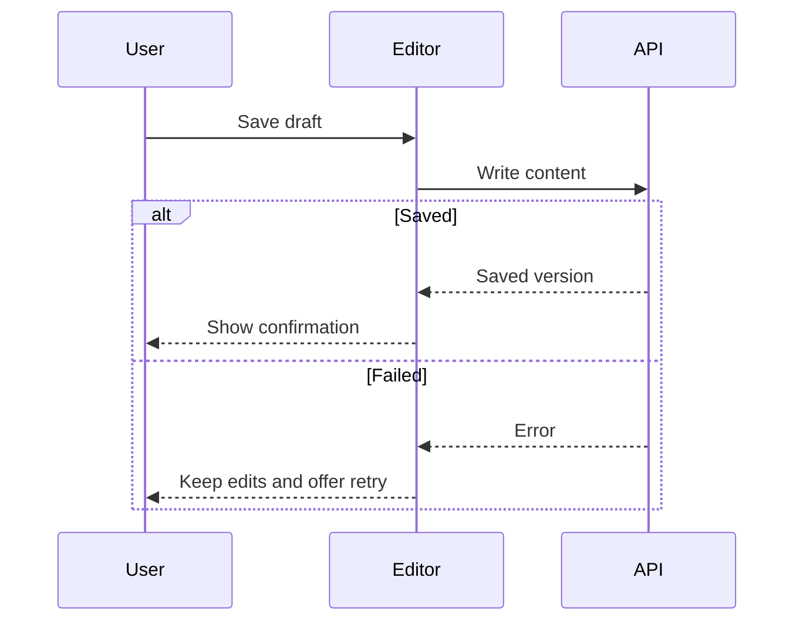

Show and explain the actual work so the user can judge it without reading code.

Your output is a review report. Ground it in the request, final artifacts,
recorded decisions, and observed verification results. Use focused read-only
inspection to resolve gaps in the explanation. Report remaining implementation
work explicitly.

## What to preserve

Include anything that could change the user's judgment of:

- What the system does.
- Whether the requested scope was completed correctly.
- Whether the design choices and trade-offs are acceptable.
- Whether existing callers, users, or data remain compatible.
- Whether the work is ready to use.

Remove repetition, routine activity, and implementation details that do not
help the user make those judgments.

## Build the report in this order

Use these sections for substantial work. For a small change, combine them
into a short explanation and visual. Omit sections with no meaningful content.

### Result

State what changed, its practical effect, and whether the requested work
is complete. Name omitted or partially implemented requirements.

Surface any known issue that prevents safe or correct use here.

### How it works

Explain the main flow: trigger → important steps → outcome.
Include failure or recovery behavior when it changes what the user can expect.

Use a concrete example or before-and-after comparison where helpful.
For structural changes, explain how responsibilities changed and whether
observable behavior stayed the same.

Describe relevant public APIs or shared contracts that were added, changed,
or removed. Give their users, essential input/output shapes, and a compact
example. Include consequential errors, side effects, identity boundaries,
or persistence rules. Explain compatibility and migration effects.

### Decisions and trade-offs

Identify consequential choices made beyond the specification.
For each, explain the reason and practical benefit or cost.

Distinguish requirements, agent choices, and assumptions made because
information was missing. For consequential assumptions, state what depends
on them and what needs confirmation.

Include known limitations and concrete risks alongside the decision or
behavior that creates them.

### Verification

State which checks ran, their results, and what they actually establish.
Include relevant failures and unverified behavior.

Distinguish static checks, tests using substitutes, integration checks,
and direct runtime observation. Passing one does not establish the others.

### Your attention

Identify specific behavior or trade-offs worth reviewing.

If a user decision remains, give the question, your recommendation, and
its consequence. Distinguish that decision from an implementation defect
or unfinished work. If no decision remains, omit this section.

## Evidence and uncertainty

Describe observed facts as facts and inferences as inferences.
A name such as "fallback" or "retry" is not evidence of its exact behavior.

Use recorded rationale when explaining why a choice was made. If the reason
is unavailable, say so rather than inventing a justification.

Place useful evidence links beside consequential claims. Explain what the
evidence shows in the report itself; following the link should be optional.

Use synthetic examples and redact sensitive values.

## Visuals

Include at least one diagram or change sketch in the explanation. Choose its
form, not whether to include it. Skip only when the user requests prose alone
or the change is a trivial text/value edit with no flow or structure to explain.

Pick the smallest view that shows the central behavior or change. Adapt these
examples to the actual work; one well-chosen visual is usually enough.

**Logic or a behavioral change — pseudocode or a diff:**

```diff
on(save)
-  write content
+  if content is unchanged
+    return cached result
+  write content
+  invalidate cache
```

**Runtime order — a call tree:**

```text
submitForm
  validateInput
  saveDraft
    persistContent
  showConfirmation
```

**UI composition or ownership — a component or file tree:**

```text
<EditorPage>
  <DraftForm>          # owns unsaved edits
  <SaveStatus>         # displays persistence state
  <HistoryPanel>       # reads saved versions
```

**Interactions and failure paths — Mermaid:**



Use a state diagram for transitions and recovery. Use a table for comparisons
or contract shapes when those are the central point. Show the whole new shape
instead of a diff when omitted context would hide ownership or order.

Use concrete labels and preserve important failure paths. Mark proposed or
unverified behavior explicitly. Keep only the parts needed to understand the
point; let the visual carry structure and the prose explain consequences.

Place the visual beside the text it supports. Prefer chat-native output;
use a separate HTML artifact only when requested or when the explanation
requires interaction or a spatial view that inline formats cannot provide.

## Final coverage check

Compare the report with the request and final artifacts. Ensure it accounts
for material changes, incomplete scope, consequential choices, compatibility
effects, and verification gaps.

Then remove duplication and unnecessary terminology. Keep the result and
most important concerns easy to find.
